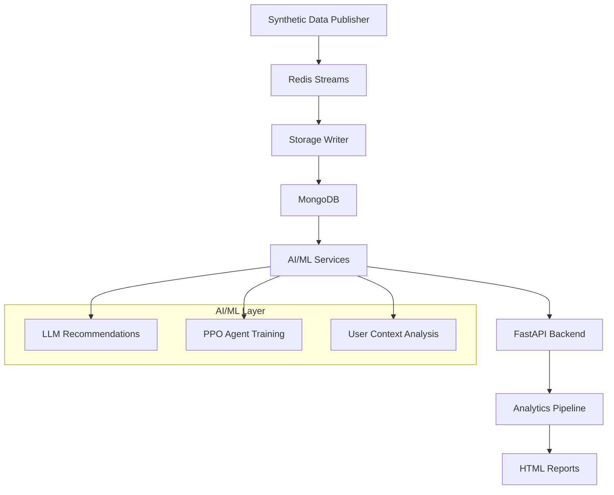

# Personalized Fitness Tracker

[](https://python.org)
[](https://docker.com)
[](https://mongodb.com)
[](https://redis.io)
[](https://fastapi.tiangolo.com)

An end-to-end AI-powered fitness tracking system that generates synthetic wearable data, provides personalized recommendations through LLM integration, trains reinforcement learning agents for adaptive workout planning, and delivers comprehensive analytics reports.

## Project Overview

This system simulates a complete wearable-to-insights pipeline featuring:

- **Real-time data streaming** via Redis Streams
- **Scalable data storage** with MongoDB
- **AI-powered recommendations** using LLM integration  
- **Adaptive workout planning** with PPO reinforcement learning
- **Comprehensive analytics** with automated HTML reports
- **RESTful API** for client integration

## Architecture



### Core Components

1. **Data Pipeline**
   - **Publisher**: Multi-threaded synthetic data generation
   - **Storage Writer**: Redis → MongoDB with intelligent batching
   - **Redis Streams**: Real-time message broker
   - **MongoDB**: Persistent data lake

2. **AI/ML Services**
   - **LLM Integration**: Personalized workout/nutrition plans via Ollama
   - **PPO Agent**: Reinforcement learning for adaptive recommendations
   - **Context Engine**: User behavior analysis and profiling

3. **Analytics & Reporting**
   - **Weekly Reports**: Automated HTML dashboards
   - **Performance Metrics**: Cross-stream data analysis
   - **Health Insights**: Rule-based recommendation engine

## Quick Start

### Prerequisites

- Docker & Docker Compose (v2+)
- Python 3.8+ (optional, for local development)
- 8 GB RAM minimum
- Ollama server (for LLM features)

### Installation

1. **Clone the repository**
   ```bash
   git clone <repository-url>
   cd personalized-fitness-tracker
   ```

2. **Start the core infrastructure**
   ```bash
   docker compose up --build -d
   ```

3. **Verify services**
   ```bash
   # Check Redis
   docker exec -it redis redis-cli ping
   
   # Check MongoDB
   docker exec -it mongo mongosh --eval "db.adminCommand('ismaster')"
   
   # View logs
   docker compose logs -f publisher storage_writer
   ```

4. **Launch AI/ML services**
   ```bash
   # Start FastAPI backend
   uvicorn llm.app:app --reload --host 0.0.0.0 --port 8000
   
   # Train PPO agent (optional)
   docker compose --profile training run --rm trainer
   ```

## 📊 Data Pipeline

### Redis Streams

The system generates and processes six primary data streams:

- **`fitness:users`** - User profiles and demographics
- **`fitness:devices`** - Wearable device information  
- **`fitness:events`** - Workout activities with biometrics
- **`fitness:sleep`** - Sleep session quality and patterns
- **`fitness:nutrition`** - Meal logging and caloric intake
- **`fitness:feedback`** - Daily mood and energy ratings

### Data Schema

#### Fitness Events
```json
{
  "event_id": "uuid",
  "user_id": "uuid", 
  "device_id": "uuid",
  "activity_type": "running|cycling|strength",
  "duration_s": 1800,
  "heart_rate_bpm": 145,
  "calories_burned": 320,
  "step_increment": 2500,
  "event_ts": "2025-07-28T14:30:00Z"
}
```

#### Sleep Sessions  
```json
{
  "session_id": "uuid",
  "user_id": "uuid",
  "start_ts": "2025-07-27T23:00:00Z",
  "end_ts": "2025-07-28T07:00:00Z", 
  "quality": 0.85,
  "sleep_stage_breakdown": {...},
  "awakenings": 2
}
```

## AI/ML Features

### LLM-Powered Recommendations

**Endpoints:**
- `GET /workout/{user_id}` - 7-day personalized workout plan
- `GET /nutrition/{user_id}` - 3-day meal recommendations  
- `POST /feedback/{user_id}` - Collect user feedback
- `GET /plans/{user_id}/history` - Historical plan archive

**Configuration:**
```bash
export OLLAMA_API=http://127.0.0.1:11434/api/generate
export OLLAMA_MODEL=llama3.2:latest
export MONGO_URI=mongodb://localhost:27017
```

### PPO Reinforcement Learning Agent

**Training Pipeline:**
```bash
#start training
python train_agent.py

#monitor with TensorBoard  
tensorboard --logdir tensorboard_logs --port 6006
```

**Key Hyperparameters:**
- **Learning Rate**: 3e-4 → 0 (linear decay)
- **Clip Range**: 0.1
- **Batch Size**: 1024 (4096 steps / 4 envs)
- **Gamma**: 0.995
- **GAE Lambda**: 0.98

**Environment Details:**
- **Observation Space**: 30-step rolling window × 5 features
- **Action Space**: 2D continuous (intensity_delta, duration_delta)
- **Reward Function**: Health improvement vs. adjustment smoothness

## Analytics & Reporting

### Weekly Report Generation

Generate comprehensive HTML reports for individual users:

```bash
python -m analysis.run_analysis --user_id <user-uuid>
```

**Report Features:**
- **Weekly Trend Analysis** across all data streams  
- **Personalized Recommendations** via rule-based engine
- **Health Insights** with color-coded priorities

### Python Analysis Libraries

**Core Dependencies:**
- **pandas** - Time series resampling and aggregation
- **pymongo** - MongoDB integration with aggregation pipelines
- **pathlib** - Modern file system operations
- **datetime** - Timestamp processing

**Key Algorithms:**
- **Weekly Resampling**: `df.resample("W").agg(functions)`
- **Multi-Stream Fusion**: Temporal alignment with outer joins
- **Missing Data Handling**: Graceful empty DataFrame processing
- **Rule-Based Recommendations**: Multi-criteria health assessment

## Development

### Local Development Setup

1. **Install Python dependencies**
   ```bash
   pip install -r requirements.txt
   ```

2. **Start infrastructure only**
   ```bash
   docker compose up redis mongo -d
   ```

3. **Run services locally**
   ```bash
   # Publisher
   python publish.py
   
   # Storage Writer  
   python storage_writer.py
   
   # FastAPI Backend
   uvicorn llm.app:app --reload
   ```

### Project Structure

```
personalized-fitness-tracker/
├── data/                     # Static CSV/Parquet exports
├── analysis/                 # Analytics and reporting
│   ├── data_load.py         # MongoDB → DataFrame utilities
│   ├── user_report.py       # Weekly report generation  
│   └── run_analysis.py      # CLI interface
├── llm/                     # AI/ML services
│   ├── app.py              # FastAPI application
│   ├── plan_generator.py   # LLM integration
│   └── user_context.py     # Context building
├── agent/                   # Reinforcement learning
│   ├── train_agent.py      # PPO training pipeline
│   └── fitness_env.py      # Custom Gym environment
├── publish.py              # Synthetic data publisher
├── storage_writer.py       # Redis → MongoDB writer
├── docker-compose.yml      # Infrastructure definition
└── requirements.txt        # Python dependencies
```

### Environment Variables

```bash
# Redis Configuration
REDIS_HOST=localhost
REDIS_PORT=6379

# MongoDB Configuration  
MONGO_URI=mongodb://localhost:27017

# LLM Configuration
OLLAMA_API=http://127.0.0.1:11434/api/generate
OLLAMA_MODEL=llama3.2:latest

# API Configuration
PORT=8000
```

## API Documentation

### Health Check
```bash
curl http://localhost:8000/
# Response: {"msg": "AI Fitness & Nutrition API up."}
```

### Generate Workout Plan
```bash
curl http://localhost:8000/workout/550e8400-e29b-41d4-a716-446655440000
```

### Submit Feedback
```bash
curl -X POST http://localhost:8000/feedback/550e8400-e29b-41d4-a716-446655440000 \
  -H "Content-Type: application/json" \
  -d '{"energy": 4, "mood": 5, "perceived_exertion": 3}'
```

## Configuration & Tuning

### PPO Training Parameters

**Current Configuration:**
```python
hyperparameters = {
    "n_steps": 4096,
    "batch_size": 1024, 
    "gamma": 0.995,
    "gae_lambda": 0.98,
    "learning_rate": 3e-4,  #linear decay to 0
    "clip_range": 0.1,
    "ent_coef": 0.01,
    "vf_coef": 0.5
}
```

**Training Progress:**
- **Episode Reward**: -5.5 → -0.06 (7M timesteps)
- **Policy Loss**: Stable near zero
- **Value Loss**: Decreasing trend
- **Explained Variance**: 0.4 → 0.52

### Recommendation Engine Rules

```python
# Workout frequency
if workout_count < 3:
    recommend("Increase workout frequency to ≥3 per week")

# Sleep quality  
if sleep_quality < 0.7:
    recommend("Improve sleep hygiene and wind-down routine")

# Activity level
if daily_steps < 5000:
    recommend("Add walking sessions to reach step goals")
```

## Monitoring & Observability

### Service Health Checks

```bash
# Redis connectivity
redis-cli -h localhost -p 6379 ping

# MongoDB status
mongosh --host localhost:27017 --eval "db.adminCommand('ping')"

# Stream monitoring
python redis_reader_testing.py
```

## Deployment & Scaling

### Docker Compose Production

```bash
# Production deployment
docker compose -f docker-compose.prod.yml up -d

# Scale storage writers
docker compose up --scale storage_writer=3 -d

# Monitor resource usage
docker stats
```

## Contributing

1. **Fork the repository**
2. **Create a feature branch**: `git checkout -b feature/amazing-feature`
3. **Make your changes** and add tests
4. **Run the test suite**: `pytest`
5. **Commit your changes**: `git commit -m 'Add amazing feature'`
6. **Push to the branch**: `git push origin feature/amazing-feature`
7. **Open a Pull Request**

### Development Guidelines

- Follow PEP 8 style guidelines
- Add type hints for new functions
- Include docstrings for public APIs
- Write unit tests for core functionality
- Update documentation for new features

## License

This project is licensed under the MIT License - see the [LICENSE](LICENSE) file for details.

## Acknowledgments

- **Stable Baselines3** for reinforcement learning framework
- **FastAPI** for high-performance API development
- **MongoDB** for flexible document storage
- **Redis** for real-time data streaming
- **Ollama** for local LLM deployment

---

